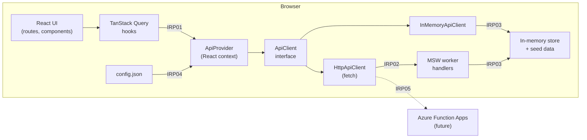

# PLAN — Local UI Sample (Vite + React, interfaced TS APIs)

## 1. Goal

Build a runnable, local-only reference UI that validates the target frontend stack and establishes the **API-by-interface** pattern before any server work begins.

The sample must:

- Run with `pnpm dev`. No backend, cloud, or auth is required.
- Talk to the API only through **TypeScript interfaces**, so the implementation behind them can be swapped (in-memory → mocked HTTP → real Function Apps) without touching UI code.
- Produce a **single static build** configured at runtime, ready for build-once-deploy-many via ADO later.

### Non-goals (for now)

- Server-side rendering or any Node runtime in production.
- Real authentication. The design leaves a seam for MSAL/Entra ID but does not implement it.
- The ADO pipeline itself. It is planned in §12 and not built in this sample.

---

## 2. Stack

| Concern | Choice | Notes |
|---|---|---|
| Build / dev server | **Vite** (React + TS template) | Pin the latest stable version at scaffold time; the lockfile is the record |
| Package manager | **pnpm** workspaces | Two packages: `apps/web` and `packages/api-contract` |
| Language | **TypeScript**, `strict: true` | Also enable `noUncheckedIndexedAccess` and `exactOptionalPropertyTypes` |
| Routing | **TanStack Router** (file-based via Vite plugin) | Type-safe params and search params |
| Server state | **TanStack Query** | Router loaders prefetch via `ensureQueryData` |
| Components | **MUI** + **MUI X DataGrid** (free tier) | Pro/Premium features are out of scope; note in §13 |
| Layout | **MUI only** (`Box`, `Stack`, `Grid`, `Container`, `sx`) | No Tailwind or other CSS framework; see §8 |
| Schemas / validation | **Zod** | Single source for runtime validation and TS types |
| Local API | **MSW** (Mock Service Worker) + in-memory store | Real `fetch` semantics with no server |
| Unit / contract tests | **Vitest** + Testing Library | |
| E2E | **Playwright** | Runs against `vite preview` with MSW on |
| Lint / format | **Biome** | Replaces ESLint and Prettier |

---

## 3. Architecture

The UI depends only on the `ApiClient` interface. Adapters implement it, and the adapter is chosen at startup from runtime config.



| IRP | From → To | Mechanism | Contract |
|---|---|---|---|
| IRP01 | Query hooks → ApiProvider | `useApi()` returns an `ApiClient` | `packages/api-contract` interfaces |
| IRP02 | HttpApiClient → MSW | `fetch` to `${apiBaseUrl}/…`, intercepted in the browser | REST paths + Zod DTO schemas |
| IRP03 | Adapter / MSW handlers → store | Direct function calls | Internal store API (not public) |
| IRP04 | `config.json` → app bootstrap | `fetch('/config.json')` before render | `RuntimeConfig` Zod schema |
| IRP05 | HttpApiClient → Function Apps | HTTPS + bearer token (future) | Same REST contract as IRP02 |

**Key property:** IRP02 and IRP05 share one contract. Switching from MSW to real Function Apps changes config only, not code.

---

## 4. Repo layout

```
ui-sample/
├─ package.json                 # pnpm workspace root, shared scripts
├─ pnpm-workspace.yaml
├─ biome.json
├─ tsconfig.base.json
├─ packages/
│  └─ api-contract/             # framework-free; later consumable by Function Apps
│     ├─ src/
│     │  ├─ schemas/            # Zod schemas (DTOs, queries, errors)
│     │  ├─ interfaces/         # ApiClient + per-resource interfaces
│     │  ├─ routes.ts           # REST path builders shared by client & MSW
│     │  └─ index.ts
│     └─ package.json
└─ apps/
   └─ web/
      ├─ public/
      │  ├─ config.json         # runtime config (replaced per env at deploy)
      │  └─ mockServiceWorker.js
      ├─ src/
      │  ├─ main.tsx            # load config → start MSW (if on) → render
      │  ├─ config/             # RuntimeConfig loader
      │  ├─ api/
      │  │  ├─ ApiProvider.tsx
      │  │  ├─ createApiClient.ts   # factory: mode → adapter
      │  │  ├─ http/            # HttpApiClient
      │  │  ├─ memory/          # InMemoryApiClient
      │  │  └─ mock/            # store, seed, MSW handlers
      │  ├─ queries/            # queryOptions factories per resource
      │  ├─ routes/             # TanStack Router file routes
      │  ├─ components/
      │  ├─ theme/              # MUI theme (brand tokens)
            ├─ tests/                 # Vitest (unit + contract)
      ├─ e2e/                   # Playwright
      └─ vite.config.ts
```

---

## 5. API contract (`packages/api-contract`)

The sample domain is Programs → Beneficiaries → Disbursements. It is small but realistic enough to exercise lists, detail views, create, and status transitions.

### 5.1 Schemas are the source of truth

```ts
// schemas/beneficiary.ts
export const BeneficiaryId = z.string().uuid().brand<'BeneficiaryId'>();
export const Beneficiary = z.object({
  id: BeneficiaryId,
  programId: ProgramId,
  displayName: z.string().min(1),
  country: z.string().length(2),          // ISO 3166-1 alpha-2
  status: z.enum(['pending', 'verified', 'suspended']),
  createdAt: z.string().datetime(),
});
export type Beneficiary = z.infer<typeof Beneficiary>;

export const NewBeneficiary = Beneficiary.pick({ programId: true, displayName: true, country: true });
export type NewBeneficiary = z.infer<typeof NewBeneficiary>;
```

### 5.2 Shared building blocks

```ts
export const ListQuery = z.object({
  page: z.number().int().min(0).default(0),
  pageSize: z.number().int().min(1).max(200).default(25),
  sort: z.string().optional(),            // "field:asc|desc"
  q: z.string().optional(),
});
export const Page = <T extends z.ZodTypeAny>(item: T) =>
  z.object({ items: z.array(item), total: z.number().int(), page: z.number().int(), pageSize: z.number().int() });

export const ApiErrorBody = z.object({
  code: z.enum(['not_found', 'validation', 'conflict', 'unavailable', 'unknown']),
  message: z.string(),
  details: z.record(z.unknown()).optional(),
});
export class ApiError extends Error { constructor(public status: number, public body: ApiErrorBody) { super(body.message); } }
```

### 5.3 Interfaces

```ts
export interface ProgramApi {
  list(q: ListQuery): Promise<Page<Program>>;
  get(id: ProgramId): Promise<Program>;
}
export interface BeneficiaryApi {
  list(programId: ProgramId, q: ListQuery): Promise<Page<Beneficiary>>;
  get(id: BeneficiaryId): Promise<Beneficiary>;
  create(input: NewBeneficiary): Promise<Beneficiary>;
  setStatus(id: BeneficiaryId, status: Beneficiary['status']): Promise<Beneficiary>;
}
export interface DisbursementApi {
  list(q: ListQuery & { programId?: ProgramId; beneficiaryId?: BeneficiaryId }): Promise<Page<Disbursement>>;
  create(input: NewDisbursement): Promise<Disbursement>;
  approve(id: DisbursementId): Promise<Disbursement>;
}
export interface ApiClient {
  programs: ProgramApi;
  beneficiaries: BeneficiaryApi;
  disbursements: DisbursementApi;
}
```

### 5.4 Contract rules

- All methods return Promises and throw `ApiError` on failure. No adapter-specific error types leak out.
- Adapters **must** validate responses with the Zod schemas at the boundary. The HTTP adapter parses every response; the in-memory adapter parses on write.
- `routes.ts` exports path builders (for example `paths.beneficiary(id)`) used by both `HttpApiClient` and the MSW handlers, so paths cannot drift.
- `api-contract` has **no React or browser dependencies**, so it can be imported by Node Function Apps later.

---

## 6. Adapters

| Mode | Adapter | What it proves | Use for |
|---|---|---|---|
| `memory` | `InMemoryApiClient` | The interface is sufficient on its own | Fastest unit tests, Storybook-style isolation |
| `msw` (default) | `HttpApiClient` → MSW → store | The real HTTP path: serialization, status codes, errors, latency | Local dev, E2E |
| `http` | `HttpApiClient` → real base URL | Nothing extra; switching is config only | Future Function Apps |

### Local API behaviour (MSW handlers)

- Seed with a deterministic set (fixed faker seed): about 3 programs, 500 beneficiaries, and 2,000 disbursements, enough to exercise DataGrid paging and sorting.
- Configurable **latency** (default 150–400 ms) and **failure injection** (for example 5% `503`) through config, so loading and error states are real.
- State lives in memory for the session. An optional reset endpoint `POST /__dev/reset` returns the store to the seed.
- Server-side paging, sort, and filter are implemented in the store, matching what the real API will do. The UI never pages client-side.

### Factory

```ts
export function createApiClient(cfg: RuntimeConfig): ApiClient {
  switch (cfg.apiMode) {
    case 'memory': return createInMemoryApiClient(createStore(cfg.mock));
    case 'msw':
    case 'http':   return createHttpApiClient({ baseUrl: cfg.apiBaseUrl, getToken: async () => undefined });
  }
}
```

`getToken` is the future MSAL seam. It is unused now.

---

## 7. Runtime configuration (build once, deploy many)

- `public/config.json` is fetched **before** React renders and validated with the `RuntimeConfig` Zod schema. The app shows a clear error screen if it is invalid.
- `import.meta.env` is **not** used for anything environment-specific. It is allowed only for build metadata (version, commit).
- At deploy time the pipeline replaces `config.json` per environment. The JS bundle is identical across dev, qa, uat, and prod.

```json
{
  "apiMode": "msw",
  "apiBaseUrl": "/api",
  "mock": { "latencyMs": [150, 400], "failureRate": 0.0 },
  "features": { "disbursementApproval": true }
}
```

---

## 8. UI layer

### Routes (TanStack Router, file-based)

| Route | Screen | Data |
|---|---|---|
| `/` | Dashboard: counts per program and status | `programs.list` + aggregates |
| `/programs/$programId/beneficiaries` | DataGrid with server paging, sort, search | `beneficiaries.list` |
| `/beneficiaries/$id` | Detail, status change, disbursement history | `beneficiaries.get`, `disbursements.list` |
| `/beneficiaries/new` | Create form | `beneficiaries.create` |
| `/disbursements` | DataGrid, approve action | `disbursements.list`, `approve` |

- **Search params are validated** with Zod (`validateSearch`), so grid page, sort, and filter state lives in the URL and is shareable.
- Loaders call `queryClient.ensureQueryData(queryOptions)`. Components use `useSuspenseQuery` with the same options.
- Mutations invalidate by query-key prefix. Status change uses an optimistic update with rollback.
- Error and pending components are set per route. `ApiError` is mapped to user-facing messages in one place.

### Forms

Use React Hook Form with a Zod resolver, reusing the contract schemas (for example `NewBeneficiary`), so client validation equals contract validation.

### Styling rule: MUI only

- **MUI owns everything**: components, layout (`Box`, `Stack`, `Grid`, `Container`), spacing, colors, typography, and component states. There is no Tailwind or other CSS framework, and no global stylesheet beyond `CssBaseline`.
- Style with the `sx` prop or `styled()` using theme tokens (`theme.spacing`, `palette`, `typography`). No hard-coded colors or pixel font sizes in components.
- Brand tokens are defined once in the MUI theme (`src/theme/`).
- Support light and dark mode through the MUI `colorSchemes` theme option with CSS variables (`cssVariables: true`).

---

## 9. Testing & quality

| Layer | Tool | What |
|---|---|---|
| Contract | Vitest | **One shared test suite run against both adapters** (memory and HTTP+MSW in Node via `msw/node`). This is the main guarantee that adapters are interchangeable. |
| Unit | Vitest + Testing Library | Query options, search-param schemas, error mapping, forms |
| E2E | Playwright | Golden paths (list → detail → status change, create, approve) plus one failure-injection test |
| Static | `tsc --noEmit`, Biome | Run in CI and in a pre-commit hook (lefthook) |

Contract test sketch:

```ts
describe.each([
  ['memory', () => createInMemoryApiClient(createStore(seed))],
  ['http+msw', () => withMswServer(() => createHttpApiClient({ baseUrl: 'http://local/api' }))],
])('ApiClient contract: %s', (_, make) => {
  it('pages beneficiaries with stable total', async () => { /* … */ });
  it('throws ApiError(not_found) for unknown id', async () => { /* … */ });
});
```

---

## 10. Scripts

| Script | Does |
|---|---|
| `pnpm dev` | Vite dev server, `apiMode=msw` |
| `pnpm build` | Type-check, then `vite build` → `apps/web/dist` |
| `pnpm preview` | Serve `dist` locally (MSW still on via `config.json`) |
| `pnpm test` | Vitest (unit + contract) |
| `pnpm e2e` | Playwright against `preview` |
| `pnpm check` | Biome lint/format + `tsc` |

---

## 11. Milestones

- [x] **M1 Scaffold:** pnpm workspace, Vite React-TS, Biome, strict tsconfig, TanStack Router plugin, MUI theme wired (light/dark), empty shell layout (app bar, nav, content).
- [x] **M2 Contract:** `api-contract` package with schemas, interfaces, errors, and path builders.
- [x] **M3 Local API:** store + seed, `InMemoryApiClient`, MSW handlers, `HttpApiClient`, factory, `ApiProvider`, runtime config loader.
- [x] **M4 Contract tests:** shared suite green for both adapters.
- [x] **M5 Screens:** dashboard, beneficiaries grid (server paging and URL state), detail and status change, create form, disbursements grid with approve.
- [x] **M6 Resilience:** latency and failure injection, route error and pending UI, optimistic update rollback.
- [x] **M7 E2E + polish:** Playwright golden paths, dark mode, a11y pass (keyboard navigation, axe check).

- [x] **M8 Beyond the sample (added during build):** World Bank Group–style modern theme (navy sidebar, tonal badges, hero dashboard); reusable `DataTable` with CSV/PDF export of all matching rows; live Server-Sent Events (`GET /events`, `DomainEvent` union, `Last-Event-ID` resume) with a timer-driven operator simulator; beneficiary document upload/download/delete (multipart, progress, Unicode-safe `Content-Disposition`, SHA-256).

Definition of done: `pnpm check && pnpm test && pnpm build && pnpm e2e` is green from a clean clone, and switching `apiMode` between `memory` and `msw` requires no code change.

---

## 12. Next steps (after the sample)

- **ADO pipeline:** a multi-stage YAML that builds once, publishes `dist` as an artifact, and deploys per environment with `config.json` substitution and Environment approvals. Use VNet-reachable agents if the ASE is internal.
- **Real API:** Function Apps implement the REST contract from `api-contract`. Publish the package to an Azure Artifacts feed or move it into a shared monorepo. Set `apiMode: "http"`.
- **Function App build:** bundle each Function App into a single ESM file with **tsdown** (Rolldown-based successor to tsup; esbuild is the fallback), inlining `@ifcui/api-contract` and all dependencies. This gives smaller zip deploys and faster cold starts. Lint/format stays **Biome** repo-wide (no ESLint/Prettier).
- **Auth:** implement `getToken` with MSAL (Entra ID) and add route guards.
- **Optionally generate an OpenAPI spec** from the Zod schemas (for example `zod-to-openapi`) for non-TS consumers and API Management.

---

## 13. Open decisions

| # | Decision | Default in this plan |
|---|---|---|
| D1 | MUI + Tailwind (layout only) vs. MUI only vs. Tailwind + shadcn/ui | **Decided: MUI only** |
| D2 | MUI X Pro/Premium license (grouping, aggregation, Excel export) | Free tier only; CSV/PDF export built in-house over the API (exports all matching rows, not just the page) |
| D3 | Contract home long-term: published package vs. monorepo | Workspace package now |
| D4 | REST + Zod contract vs. OpenAPI-first | Zod-first, OpenAPI generated later |
| D5 | Live updates transport | **Decided: SSE over fetch** (not EventSource, so bearer auth works); events carry full entities |
| D6 | Visual identity | **Decided:** World Bank Group palette/typography (Open Sans, blue scale, orange focus ring), no WBG logo or name |
